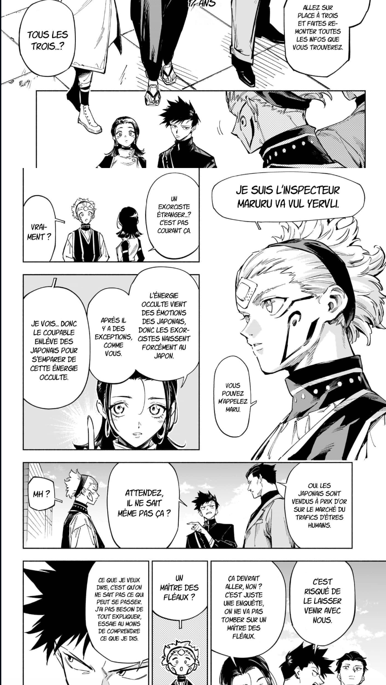
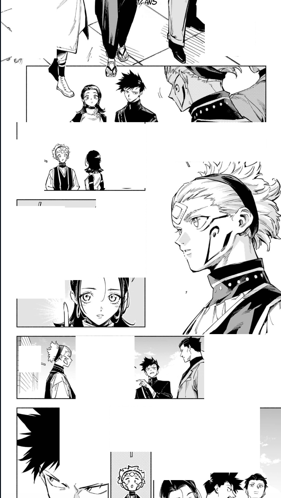
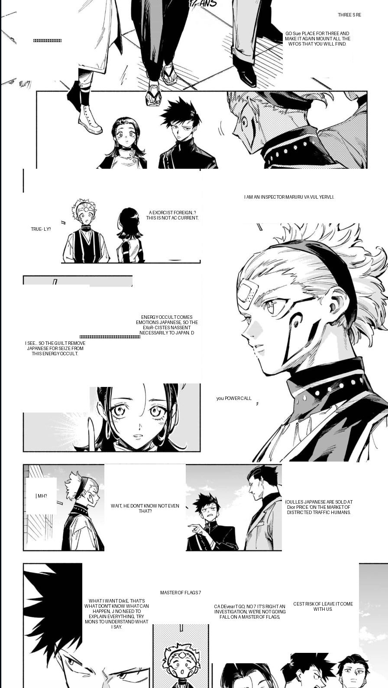

#  mangaforge-lens

> A Python library for reading, extracting, cleaning, translating, and retypesetting manga scans — automatically.

`mangaforge-lens` is part of the **MangaForge** ecosystem. It acts as the core processing pipeline for manga scans, handling everything from speech bubble detection to translated text rendering.

---

##  Features

-  **Bubble detection** — Automatically detects speech bubbles using a YOLOv8 model trained on manga, webtoon, manhua and comics
-  **OCR** — Reads text inside bubbles (supports Japanese, French, English and more)
-  **Auto language detection** — Detects the source language automatically
-  **Cleaning** — Erases original text from bubbles
-  **Translation** — Translates text to any target language (default: English)
-  **Typesetting** — Re-renders translated text inside the cleaned bubbles

---

##  Pipeline Overview

```
Original Scan
     │
     ▼
┌─────────────┐
│  detector   │  → Detects speech bubble zones
└─────────────┘
     │
     ▼
┌─────────────┐
│    ocr      │  → Reads text + detects language
└─────────────┘
     │
     ▼
┌─────────────┐
│   cleaner   │  → Erases original text
└─────────────┘
     │
     ▼
┌─────────────┐
│ translator  │  → Translates to target language
└─────────────┘
     │
     ▼
┌─────────────┐
│ typesetter  │  → Writes translated text back
└─────────────┘
     │
     ▼
Final Translated Scan
```

---

##  Examples

### Original Scan
> The raw manga scan before any processing.



---

### After Cleaning
> Text has been detected and erased from all speech bubbles.



---

### Final Result
> Translated text has been rendered back into the cleaned bubbles.



---

##  Installation

### 1. Clone the repository

```bash
git clone https://github.com/Soleil-Clems/mangaforge-lens.git
cd mangaforge-lens
```

### 2. Create and activate a virtual environment

```bash
python -m venv .venv
source .venv/bin/activate  # Mac/Linux
.venv\Scripts\activate     # Windows
```

### 3. Install dependencies

```bash
pip install -r requirements.txt
```

### 4a. Install Tesseract (Mac)

```bash
brew install tesseract
brew install tesseract-lang
```

### 4b. Install Tesseract (Linux)

```bash
sudo apt install tesseract-ocr   
sudo apt install tesseract-ocr-all   
```

### 5. Download the detection model

```bash
python download_models.py
```

---

##  Quick Start

```python
from mangaforge_lens import MangaDetector, MangaOCR, MangaCleaner, MangaTranslator, MangaTypesetter

scan_path = "tests/test_scan.jpg"

# Step 1 — Detect speech bubbles
detector = MangaDetector(scan_path)
zones = detector.detect_text_zones()
detector.preview(zones)  # optional visual preview

# Step 2 — Read text from each bubble
ocr = MangaOCR(scan_path)
ocr_results = []
for zone in zones:
    result = ocr.read_text(zone)
    result.update(zone)
    ocr_results.append(result)

# Step 3 — Clean original text
cleaner = MangaCleaner(scan_path)
cleaner.clean_all(zones)
cleaner.save("tests/cleaned_scan.jpg")

# Step 4 — Translate
translator = MangaTranslator(target_lang="en")
translated = translator.translate_zones(ocr_results)

# Step 5 — Typeset translated text
typesetter = MangaTypesetter("tests/cleaned_scan.jpg")
typesetter.apply(translated)
typesetter.save("tests/final_scan.jpg")
```

---

##  Project Structure

```
mangaforge-lens/
├── mangaforge_lens/
│   ├── __init__.py        # Exposes all public classes
│   ├── detector.py        # YOLOv8-based bubble detection
│   ├── ocr.py             # Text extraction + language detection
│   ├── cleaner.py         # Text erasing
│   ├── translator.py      # Translation via Google Translate
│   └── typesetter.py      # Text rendering
├── models/
│   └── comic-speech-bubble-detector.pt
├── tests/
│   └── test_scan.jpg
├── download_models.py
├── main.py
├── requirements.txt
└── README.md
```

---

##  Part of the MangaForge Ecosystem

| Package | Description |
|---|---|
| **mangaforge-lens** | Scan reading, OCR, translation, typesetting *(this package)* |
| **mangaforge-colorizer** | AI-based colorization of black & white scans *(coming soon)* |
| **mangaforge** | Main orchestrator combining all packages *(coming soon)* |

---

##  License

MIT License — feel free to use, modify and distribute.